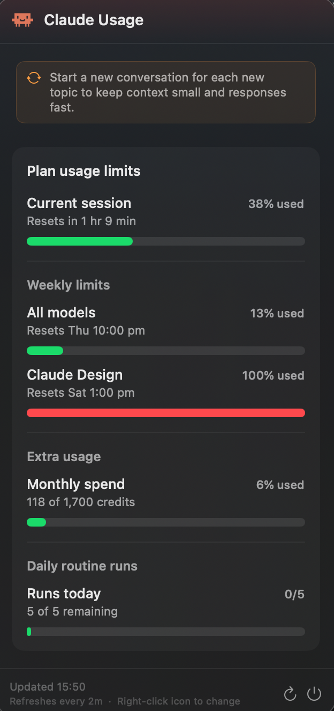

# ClaudeUsageMonitor · v2.0.0

Track your [Claude.ai](https://claude.ai) usage in real time — available as a native **macOS menu-bar app** and a **Windows system-tray app**. No API key needed.


---

## Demo




---

## Features

| Feature | macOS | Windows |
|---------|:-----:|:-------:|
| Native tray / menu-bar icon | ✓ | ✓ |
| Colour-coded icon (green → orange → red) | ✓ | ✓ |
| 5-hour session usage bar | ✓ | ✓ |
| 7-day weekly usage bar | ✓ | ✓ |
| Sonnet-specific usage bar | | ✓ |
| Reset countdowns | ✓ | ✓ |
| Configurable auto-refresh | ✓ | ✓ |
| Stale data indicator | ✓ | ✓ |
| Burn-rate display (estimated time left) | ✓ | |
| Native OS notifications | ✓ | |
| Smart tip banner | ✓ | |
| In-app update banner | ✓ | |
| Right-click context menu | ✓ | ✓ |
| Dark-themed popup window | | ✓ |

---

## macOS

### Requirements

- macOS 13 Ventura or later
- An active Claude.ai account (Free, Pro, Team, or Max)

### Installation (pre-built DMG)

**Step 1 — Download**

Download the latest **ClaudeUsageMonitor.dmg** from the [Releases page](https://github.com/theDanButuc/Claude-Usage-Monitor/releases/latest).

**Step 2 — Install**

1. Double-click `ClaudeUsageMonitor.dmg` to mount it
2. Drag **ClaudeUsageMonitor** into the **Applications** folder shortcut

**Step 3 — First launch (Gatekeeper bypass)**

Because the app is **ad-hoc signed** (not yet notarized with an Apple Developer ID), macOS will block it on first open.

Do this once:

```
Right-click ClaudeUsageMonitor.app → Open → Open
```

Or via Terminal:

```bash
xattr -cr /Applications/ClaudeUsageMonitor.app
open /Applications/ClaudeUsageMonitor.app
```

**Step 4 — Log in to Claude**

A browser window opens automatically on first run. Log in to your Claude.ai account. The window closes by itself when login succeeds and the app icon appears in your menu bar.

### Homebrew (alternative)

```bash
brew tap theDanButuc/tap
brew install --cask claude-usage-monitor
```

### Usage (macOS)

| Element | Meaning |
|---------|---------|
| **Green** `12% \| 24%` | Plenty of messages left (< 50 % used) |
| **Orange** `~45min left \| 62%` | Burn rate active — estimated time left shown |
| **Red** `~8min left \| 91%` | Almost out — act fast |
| **Grey** `⚠ ~45min left \| 24%` | Data is stale (last update > 10 min ago) |

**Left-click** the icon to open the popover:

- **Current session** bar — rate-limit window usage with "Resets in X hr Y min" countdown
- **Weekly limits** bar — billing-period usage with reset day and time
- **Refresh** (↻) — force an immediate scrape
- **Quit** — exit the app

**Right-click** for a quick context menu with usage info, refresh interval (30s / 1m / 2m / 5m / 10m), and Quit.

### Building from source (macOS)

You need **Xcode Command Line Tools** — full Xcode is not required.

```bash
xcode-select --install   # if not already installed
```

```bash
git clone https://github.com/theDanButuc/Claude-Usage-Monitor.git
cd Claude-Usage-Monitor

bash mac/scripts/build.sh             # native arch (arm64 or x86_64)
bash mac/scripts/build.sh --universal # universal binary (arm64 + x86_64)
```

Produces `dist/ClaudeUsageMonitor-vX.X.X.dmg` ready to install.

### Troubleshooting (macOS)

| Symptom | Fix |
|---------|-----|
| "Cannot be opened because the developer cannot be verified" | Right-click → Open, or run `xattr -cr /Applications/ClaudeUsageMonitor.app` |
| Login window keeps appearing | Your Claude session expired — log in again |
| Shows `0/0` or no numbers | Claude.ai's page changed; open a GitHub Issue with your macOS version |
| Icon missing from menu bar | Quit via the popover's Quit button and re-open the app |
| App won't launch after macOS update | Rebuild from source with the updated SDK |

---

## Windows

### Requirements

- Windows 10 or later
- An active Claude.ai account (Free, Pro, Team, or Max)
- Python 3.11+ (only if running from source)

### Installation (pre-built EXE)

Download the latest **ClaudeUsageMonitor-windows.zip** from the [Releases page](https://github.com/theDanButuc/Claude-Usage-Monitor/releases/latest), extract it, and run `ClaudeUsageMonitor.exe`.

On first launch a browser window opens so you can log in to Claude.ai. Your session key is stored in `%APPDATA%\ClaudeUsageMonitor\session.json` and reused on subsequent launches.

### Usage (Windows)

The app lives in the system tray (bottom-right of the taskbar).

- **Left-click** (or **Show Usage** from the right-click menu) — opens a dark popup with three usage bars: **5-hour session**, **7-day weekly**, and **Sonnet**. Each bar shows the current percentage and a "Resets in X hr Y min" countdown.
- **Right-click** the tray icon for:
  - **Show Usage** — toggle the popup
  - **Refresh Now** — immediate data refresh
  - **Poll Frequency** — submenu to choose 30s / 1m / 2m / 5m / 10m
  - **Quit**

The icon colour reflects 5-hour session usage: green (< 60 %), yellow (60–80 %), red (> 80 %). A grey icon means data is stale (> 10 minutes old).

### Building from source (Windows)

```bash
cd windows
pip install -r requirements.txt
python tray_app.py
```

To produce a standalone EXE with PyInstaller:

```bash
cd windows
pyinstaller tray_app.spec
# Output: windows/dist/ClaudeUsageMonitor/ClaudeUsageMonitor.exe
```

### Troubleshooting (Windows)

| Symptom | Fix |
|---------|-----|
| Tray icon doesn't appear | Check the hidden icons area in the taskbar (^ arrow) |
| "No data yet" tooltip | First scrape is still running — wait a few seconds or click Refresh Now |
| Login window keeps appearing | Session key expired — delete `%APPDATA%\ClaudeUsageMonitor\session.json` and restart |
| Shows 0 % for all bars | Claude.ai API response changed; open a GitHub Issue |

---

## How it works

### Data source

Both versions call the `claude.ai/api/organizations/{org_id}/usage` endpoint with your stored session cookie — the same data visible on `claude.ai/settings/usage`.

**macOS** uses an embedded `WKWebView` with a JavaScript fetch/XHR interceptor injected at document start. This captures session-window data (e.g. the 5-hour rate-limit window) not visible in the page's DOM text, and stores your session automatically via `WKWebsiteDataStore.default()`.

**Windows** uses `curl_cffi` to make direct API requests, impersonating Chrome to avoid bot detection. The session key is extracted once via a Playwright browser login and cached in `%APPDATA%\ClaudeUsageMonitor\session.json`.

---

## Project structure

```
Claude-Usage-Monitor/
├── mac/                                  # macOS Swift app
│   ├── ClaudeUsageMonitor/
│   │   ├── ClaudeUsageMonitorApp.swift   # @main entry point
│   │   ├── AppDelegate.swift             # Status bar, popover, refresh timer
│   │   ├── LoginWindowController.swift   # Full-screen login WebView
│   │   ├── Models/UsageData.swift        # Data model + computed helpers
│   │   ├── Services/
│   │   │   ├── WebScrapingService.swift  # WKWebView + JS interceptor
│   │   │   ├── NotificationService.swift # Threshold & reset notifications
│   │   │   └── UpdateService.swift       # GitHub Releases update check
│   │   ├── Views/
│   │   │   ├── ContentView.swift         # Popover UI (two-bar dashboard)
│   │   │   └── CircularProgressView.swift
│   │   └── Assets/AppIcon.icns
│   ├── scripts/
│   │   ├── build.sh                      # Local build + DMG script
│   │   └── make_icon.swift               # Icon generator
│   └── project.yml                       # XcodeGen spec
├── windows/                              # Windows Python app
│   ├── tray_app.py                       # Entry point + tray orchestration
│   ├── popup_window.py                   # Dark-themed CTk popup
│   ├── scraper.py                        # curl_cffi API client
│   ├── data_reader.py                    # Rate-limits file reader
│   ├── icon_generator.py                 # Dynamic PIL tray icon
│   ├── constants.py                      # Colours, paths, timing
│   └── tray_app.spec                     # PyInstaller spec
├── screenshots/
├── .github/workflows/
│   ├── release.yml                       # CI: build & publish on git tag
│   └── update-homebrew-tap.yml           # CI: update Homebrew cask
└── README.md
```

---

## License

MIT License. Feel free to use Claude Usage Monitor and contribute.
