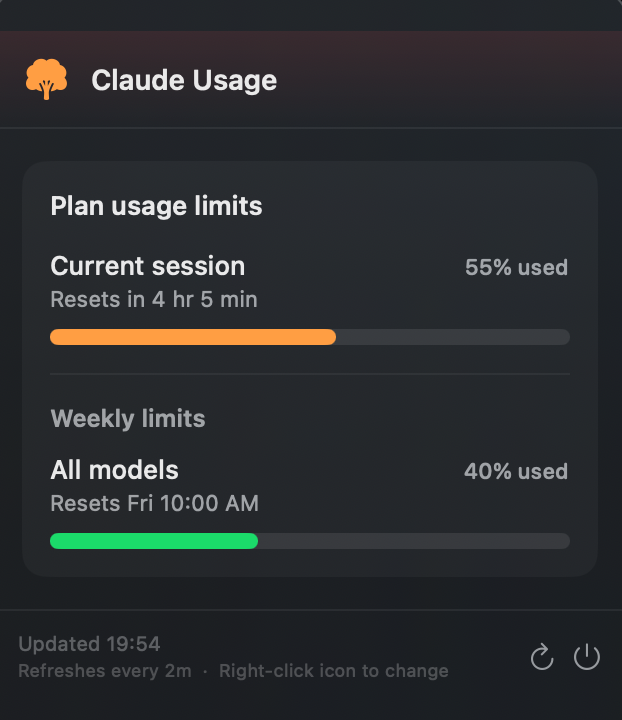

# ClaudeUsageMonitor

A native macOS menu-bar app that tracks your [Claude.ai](https://claude.ai) usage in real time — no API key needed.


---

## Screenshot



---

## Features

- **Menu-bar only** — no Dock icon, stays out of your way
- **Live percentage display** — shows `x% | y%` (Current session % | Weekly %) right in the menu bar
- **Colour-coded tree icon** — green → orange → red as usage climbs
- **Two-bar dashboard** — separate horizontal bars for Current session and Weekly limits, each with reset timing
- **Session-aware** — captures Claude's internal rate-limit window via a fetch interceptor, not just the billing-period total
- **Reset countdowns** — "Resets in X hr Y min" for the session window; "Resets Fri 10:00 AM" for weekly limits
- **Configurable auto-refresh** — 30s / 1m / 2m / 5m / 10m, set via right-click menu
- **Native notifications** — alerts at 80%, 90%, 100% usage and on session reset
- **Stale data indicator** — icon turns grey and shows ⚠ if data is older than 10 minutes
- **Right-click context menu** — quick usage info and settings without opening the popover
- **In-app update banner** — notified when a new version is available on GitHub
- **Persisted login** — WebKit stores your Claude session automatically; you only log in once

---

## Installation (recommended — pre-built DMG)

> **Requires macOS 13 Ventura or later.**

### Step 1 — Download

Download the latest **ClaudeUsageMonitor.dmg** from the [Releases page](https://github.com/theDanButuc/Claude-Usage-Monitor/releases/latest).

### Step 2 — Install

1. Double-click `ClaudeUsageMonitor.dmg` to mount it
2. Drag **ClaudeUsageMonitor** into the **Applications** folder shortcut

### Step 3 — First launch (Gatekeeper bypass)

Because the app is **ad-hoc signed** (not yet notarized with an Apple Developer ID), macOS will block it on first open.

**Do this once:**

```
Right-click ClaudeUsageMonitor.app → Open → Open
```

Or via Terminal:

```bash
xattr -cr /Applications/ClaudeUsageMonitor.app
open /Applications/ClaudeUsageMonitor.app
```

> You will **not** need to do this again after the first successful launch.

### Step 4 — Log in to Claude

A browser window opens automatically on first run. Log in to your Claude.ai account normally. The window closes by itself when login succeeds and the tree icon appears in your menu bar.

### Homebrew (alternative)

```bash
brew tap theDanButuc/tap
brew install --cask claude-usage-monitor
```

---

## Usage

| Element | Meaning |
|---------|---------|
| 🌲 **Green** `12% \| 24%` | Plenty of messages left (< 50 % used) |
| 🌲 **Orange** `55% \| 62%` | Getting there (50 – 80 % used) |
| 🌲 **Red** `88% \| 91%` | Almost out (> 80 % used) |
| 🌲 **Grey** `⚠ 12% \| 24%` | Data is stale (last update > 10 min ago) |

The two percentages are: **Current session %** | **Weekly limits %**

**Left-click** the icon to open the popover:

- **Plan usage limits** section with two progress bars:
  - **Current session** — rate-limit window usage with "Resets in X hr Y min" countdown
  - **Weekly limits / All models** — billing-period usage with "Resets Fri HH:MM AM" date
- **Refresh button** (↻) — force an immediate scrape
- **Quit button** — exit the app

**Right-click** the icon for a quick context menu:

- Current usage and reset countdown at a glance
- **Refresh Interval** submenu — choose 30s / 1m / 2m / 5m / 10m (persisted across launches)
- **Refresh Now** — immediate refresh
- **Quit**

---

## Building from source

You need **Xcode Command Line Tools** (free) — full Xcode is not required.

```bash
xcode-select --install   # if not already installed
```

Clone and build:

```bash
git clone https://github.com/theDanButuc/Claude-Usage-Monitor.git
cd Claude-Usage-Monitor

bash scripts/build.sh             # native arch (arm64 or x86_64)
bash scripts/build.sh --universal # universal binary (arm64 + x86_64)
```

Produces `dist/ClaudeUsageMonitor-vX.X.X.dmg` ready to install.

### Regenerate the app icon

```bash
swift scripts/make_icon.swift
# Produces /tmp/AppIcon.icns — copy to ClaudeUsageMonitor/Assets/AppIcon.icns
```

### Open in Xcode (optional)

```bash
brew install xcodegen
xcodegen generate          # creates ClaudeUsageMonitor.xcodeproj
open ClaudeUsageMonitor.xcodeproj
```

---

## How it works

### Data source

The app embeds a hidden `WKWebView` that loads `claude.ai/settings/usage` using your stored browser session (via `WKWebsiteDataStore.default()` — the same cookie store Safari uses for WebKit-based apps).

A JavaScript **fetch/XHR interceptor** is injected at document start, before any page script runs. It captures every API response that mentions usage, limits, or quotas and forwards the raw JSON to Swift. This gives session-window data (e.g. the 5-hour rate-limit window) not visible in the page's DOM text. A DOM-text extraction pass runs 5 s after page load as a fallback.

### Cookie persistence

`WKWebsiteDataStore.default()` persists cookies to disk between app launches automatically — no manual Keychain work needed. If the session expires, the login window reappears.

---

## Troubleshooting

| Symptom | Fix |
|---------|-----|
| "Cannot be opened because the developer cannot be verified" | Right-click → Open, or run `xattr -cr /Applications/ClaudeUsageMonitor.app` |
| Login window keeps appearing | Your Claude session expired — log in again |
| Shows `0/0` or no numbers | Claude.ai's page changed; open a GitHub Issue with your macOS version |
| Icon missing from menu bar | Quit via the popover's Quit button and re-open the app |
| App won't launch after macOS update | Rebuild from source with the updated SDK |

---

## Project structure

```
ClaudeUsageMonitor/
├── ClaudeUsageMonitor/
│   ├── ClaudeUsageMonitorApp.swift   # @main entry point
│   ├── AppDelegate.swift             # Status bar, popover, refresh timer
│   ├── LoginWindowController.swift   # Full-screen login WebView
│   ├── Models/
│   │   └── UsageData.swift           # Data model + computed helpers
│   ├── Services/
│   │   ├── WebScrapingService.swift  # WKWebView + JS interceptor
│   │   ├── NotificationService.swift # Usage threshold & reset notifications
│   │   └── UpdateService.swift       # GitHub Releases update check
│   ├── Views/
│   │   ├── ContentView.swift         # Popover UI (two-bar dashboard)
│   │   └── CircularProgressView.swift
│   ├── Assets/
│   │   └── AppIcon.icns              # All 10 icon sizes
│   ├── Info.plist
│   └── ClaudeUsageMonitor.entitlements
├── scripts/
│   ├── build.sh                       # Local build + DMG script
│   └── make_icon.swift               # Icon generator (Swift script)
├── screenshots/
│   └── popover.png                   # App screenshot
├── .github/workflows/
│   ├── release.yml                   # CI: build & publish DMG on git tag
│   └── update-homebrew-tap.yml       # CI: update Homebrew cask after release
├── project.yml                        # XcodeGen spec
└── .gitignore
```

---

## Requirements

- macOS 13 Ventura or later
- An active Claude.ai account (Free, Pro, Team, or Max)
- Internet connection

---

## License

MIT — use freely, attribution appreciated.
